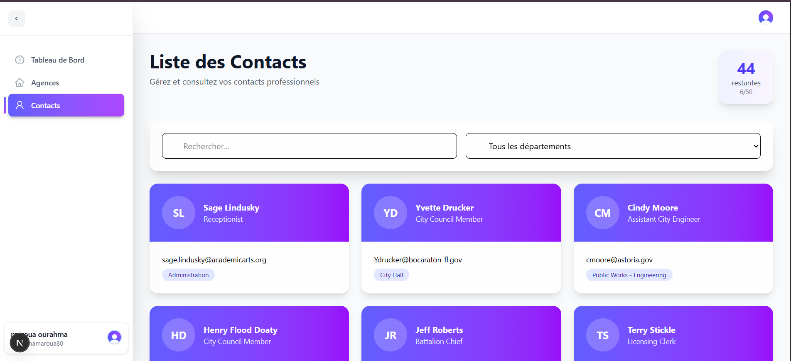
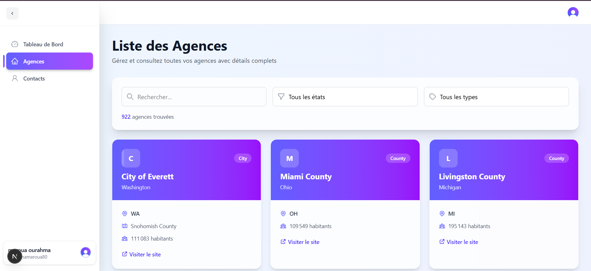
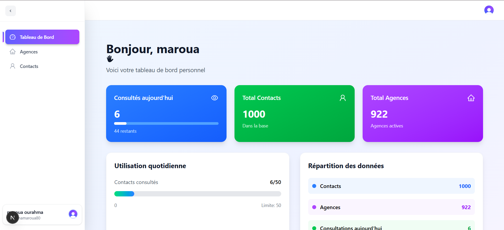

# AgenciesInsights - Tableau de Bord d'Agences


## 📖 Description

**AgenciesInsights** est une application web moderne de tableau de bord permettant la gestion et la consultation des agences et de leurs contacts. L'application offre une interface intuitive avec authentification sécurisée et des limitations d'usage quotidiennes.

## ✨ Fonctionnalités

### 🔐 Authentification
- **Système de connexion sécurisé** avec Clerk
- Gestion des sessions utilisateur
- Protection des routes privées

### 🏢 Gestion des Agences
- Consultation de la liste complète des agences
- Informations détaillées par agence (ville, adresse, téléphone)
- Interface tableau responsive

### 👥 Gestion des Contacts
- Consultation des contacts avec limite quotidienne (50/jour)
- Système de suivi des consultations via localStorage
- Messages d'alerte lorsque la limite est atteinte
- Proposition d'upgrade vers une version premium

### 📊 Tableau de Bord
- Statistiques en temps réel
- Graphiques animés de l'utilisation
- Vue d'ensemble de l'activité
- Compteurs de données (agences, contacts, consultations)

## 🛠️ Technologies Utilisées

- **Frontend**: Next.js 14 avec App Router
- **Authentification**: Clerk
- **Styling**: Tailwind CSS
- **Animations**: Framer Motion
- **Icons**: SVG personnalisés
- **Déploiement**: Vercel (recommandé)

## 🚀 Installation et Démarrage

### Prérequis
- Node.js 18+ 
- npm ou yarn
- Compte Clerk (gratuit)

### 📥 Installation

1. **Cloner le repository**
```bash
git git@github.com:ourahma/AgencyInsight.git
cd AgencyInsight
```

2. **Installer les dépendances**
```bash
npm install
```

3. **Configuration des variables d'environnement**
Créez un fichier `.env.local` à la racine :
```env

NEXT_PUBLIC_CLERK_SIGN_IN_URL=
NEXT_PUBLIC_CLERK_SIGN_UP_URL=
NEXT_PUBLIC_CLERK_AFTER_SIGN_IN_URL=
NEXT_PUBLIC_CLERK_AFTER_SIGN_UP_URL=
NEXT_PUBLIC_DAILY_LIMIT=50

NEXT_PUBLIC_CLERK_PUBLISHABLE_KEY=pk_...
CLERK_SECRET_KEY=sk_..
```

4. **Démarrer l'application en mode développement**
```bash
npm run dev
```

L'application sera accessible sur `http://localhost:3000`

## 🏗️ Structure du Projet

```
agencies-insights/
├── app/
│   ├── (auth)/
│   │   ├── login/[[...login]]/page.tsx
│   │   └── signup/[[...signup]]/page.tsx
│   ├── agencies/
│   │   └── page.tsx
│   ├── contacts/
│   │   └── page.tsx
│   ├── layout.tsx
│   └── page.tsx
├── components/
│   ├── DashboardLayout.tsx
│   ├── Navbar.tsx
│   ├── UserProfile.tsx
│   ├── UsageLimit.tsx
│   └── Icons.tsx
├── contexts/
│   └── NavbarContext.tsx
├── types/
│   └── index.ts
└── public/
```

## 🔧 Configuration

### Configuration Clerk

1. Créez un compte sur [Clerk](https://clerk.dev)
2. Créez une nouvelle application
3. Récupérez vos clés API dans le dashboard
4. Configurez les URLs de callback :
   - `http://localhost:3000` pour le développement
   - Votre domaine de production pour le déploiement

### Fonctionnalités Techniques

- **Limite de consultations** : 50 contacts par jour par utilisateur
- **Stockage local** : Utilisation de localStorage pour le suivi
- **Responsive design** : Compatible mobile et desktop
- **Animations fluides** : Expérience utilisateur moderne

## 🖥️ Démo

* **La page des contacts :**



* **La page des agences :**



* **La page de dashboard :**




## 📱 Utilisation

### Pour les Utilisateurs

1. **Inscription/Connexion**
   - Créez un compte ou connectez-vous via Clerk
   - Accédez au tableau de bord

2. **Consultation des Agences**
   - Naviguez vers la page "Agences"
   - Consultez la liste complète

3. **Gestion des Contacts**
   - Accédez à la page "Contacts"
   - Consultez jusqu'à 50 contacts par jour
   - Recevez des alertes lorsque la limite est atteinte

### Pour les Développeurs

- **Ajout de nouvelles fonctionnalités** : Suivez la structure des composants existants
- **Modification du style** : Utilisez les classes Tailwind CSS
- **Intégration d'API** : Utilisez les routes API de Next.js

## 📄 Licence

Ce projet est sous licence MIT. Voir le fichier `LICENSE` pour plus de détails.

## 🐛 Dépannage

### Problèmes Courants

1. **Erreurs d'authentification**
   - Vérifiez les clés Clerk dans `.env.local`
   - Assurez-vous que les URLs de callback sont correctes

2. **Problèmes de style**
   - Vérifiez que Tailwind CSS est correctement configuré
   - Redémarrez le serveur de développement

3. **Erreurs de build**
   - Vérifiez la version de Node.js (18+ requise)
   - Supprimez `node_modules` et relancez `npm install`

## 📞 Support

Pour toute question ou problème :
- Ouvrez une [issue](https://github.com/ourahma/AgencyInsight/issues)
- Consultez la [documentation Clerk](https://clerk.dev/docs)
- Référez-vous à la [documentation Next.js](https://nextjs.org/docs)

---

**OURAHMA Maroua 🤍**